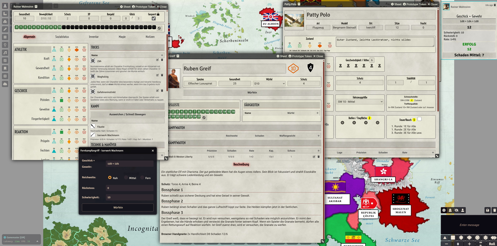

# Dieseldrachen for FoundryVTT

 

Official system implementation of the Dieseldrachen TTRPG by [Dragon Pulp Games](https://shop.dragonpulpgames.com/).

## Preview:

## Manifest-URL for manual installation of the system

    https://github.com/MrTheBino/dieseldrachen-vtt/releases/latest/download/system.json

## Features:

* character sheet
* NPC (enemy / bosses)
* vehicles
* all item types
* dice roll dialogs

## Languages

Only german is at present supported

## Version schema

* 13.X.X Foundry 13 VTT 

## 3rd Party
* This system is using the font [Dicier](https://speakthesky.itch.io/typeface-dicier), by Speak the Sky, licensed under CC BY 4.0.
* This system is using icons from [Game Icons.net](https://game-icons.net/) licensed under CC BY 4.0